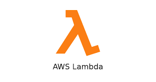
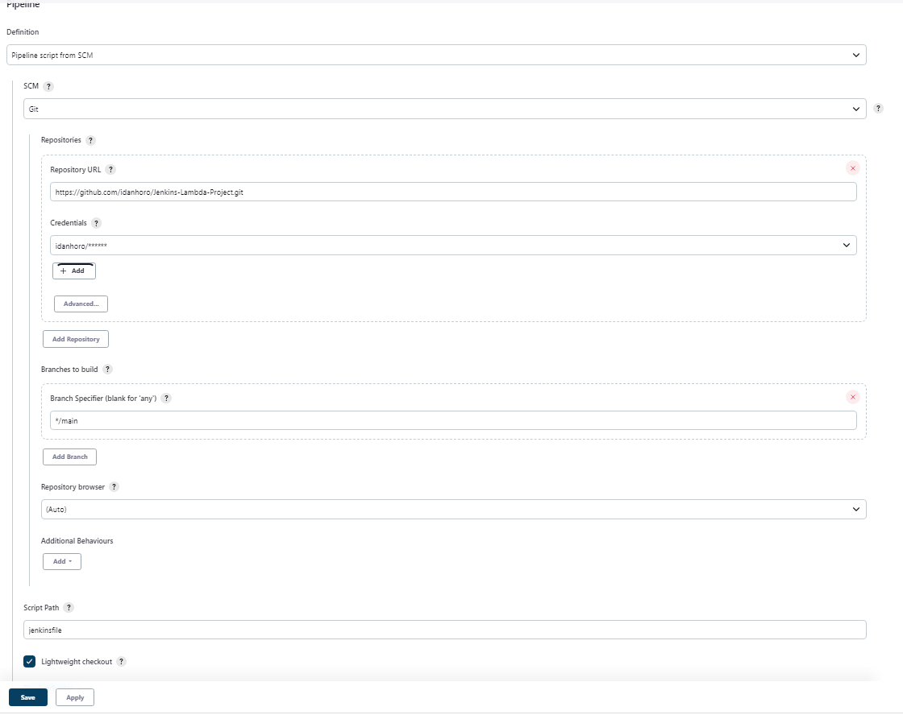
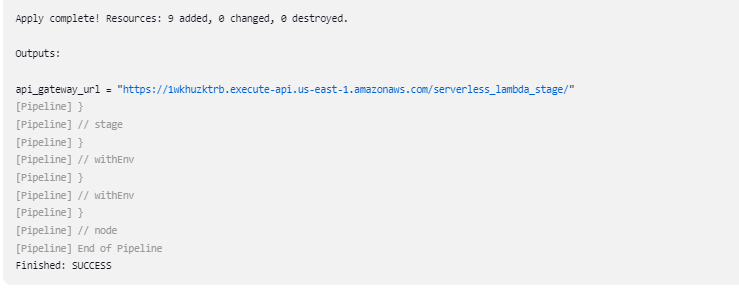
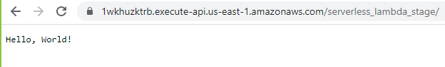

# Jenkins-Lambda-Project


This project provides a comprehensive guide on how to use Jenkins to deploy a Serverless Lambda function using Terraform.

## Prerequisites
* Docker installed on your local machine with jenkins container -> [Guide to create jenkins container](https://hub.docker.com/_/jenkins)
* AWS Account

## Setting up AWS
1. Log in to your AWS account
2. Create an IAM user with programmatic access and appropriate permissions to deploy resources
3. Make note of the access key and secret access key
4. Configure your AWS CLI with the credentials obtained in step 3

## Setting up Jenkins
1. Log in to your Jenkins server
2. Install the following plugins:
   * AWS CLI Plugin
   * Terraform plugin
3. Go to "Manage Jenkins" -> "Global Tool Configuration"
4. Under "AWS CLI", add a new installation of the AWS CLI
5. Under "Terraform", add a new installation of Terraform
6. Create a new Jenkins Pipeline linked to your GitHub repository
 


## Setting up Terraform

Create a Terraform variable file named terraform.tfvars with the following content:

```terraform
    access_key = "ACCESS_KEY"
    secret_key = "SECRET_KEY"
```

Replace `ACCESS_KEY` and `SECRET_KEY` with the access key and secret access key obtained in step 2 of the Setting up AWS section.

## Start project
1. Login to your jenkins server.
2. Go to the pipeline job created.
3. click on Build Now.
4. Now everything should run automaticly, the jenkins job will look for `jenkinsfile` and will follow the pipeline instructions there.

Output photo :

 

 


## Deploying the Serverless Lambda Function
Zip the contents of the Lambda function directory
Store the zip file in an S3 bucket
In the Jenkins job, execute the Terraform apply command to deploy the Serverless Lambda function using Terraform

# Conclusion
By following the steps in this guide, you should now have a Serverless Lambda function deployed using Jenkins and Terraform. This setup provides a scalable and automated solution for deploying Serverless functions.